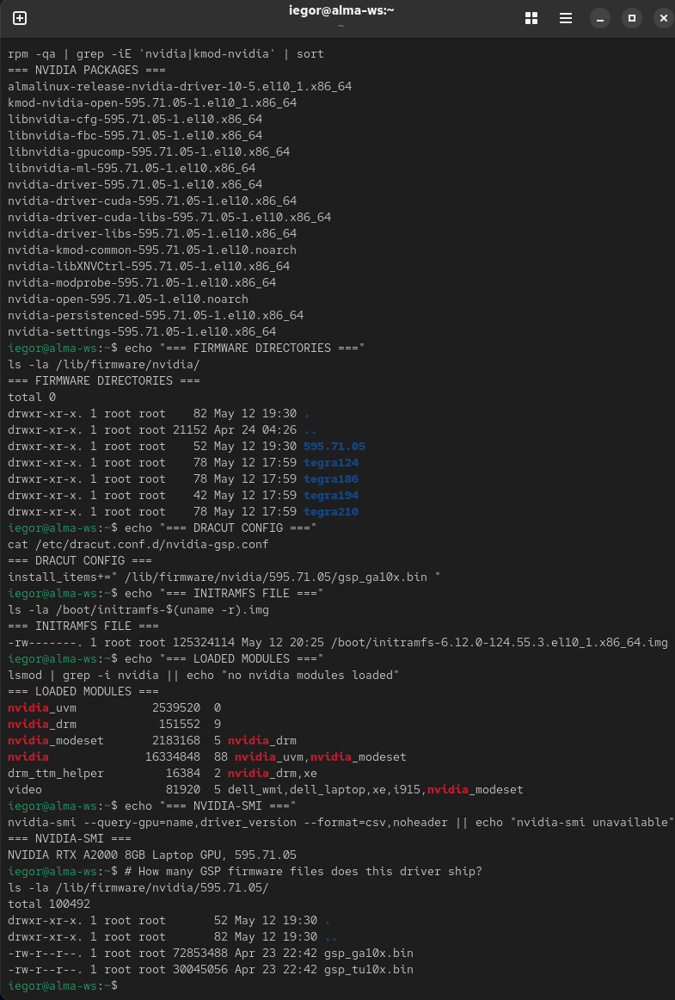
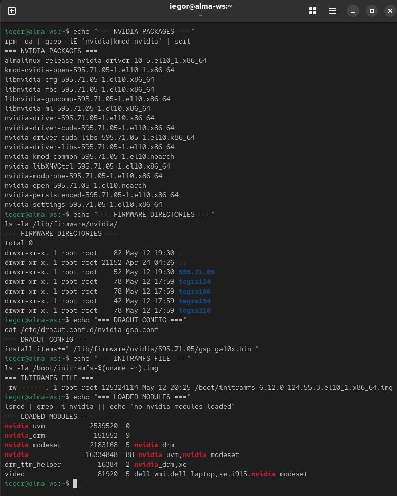
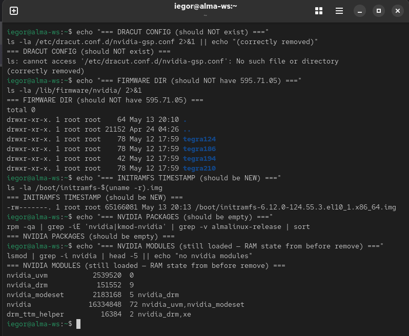
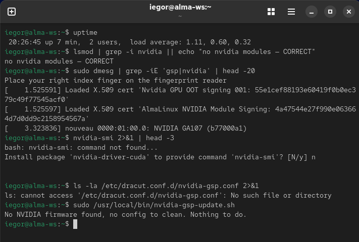
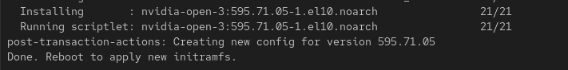
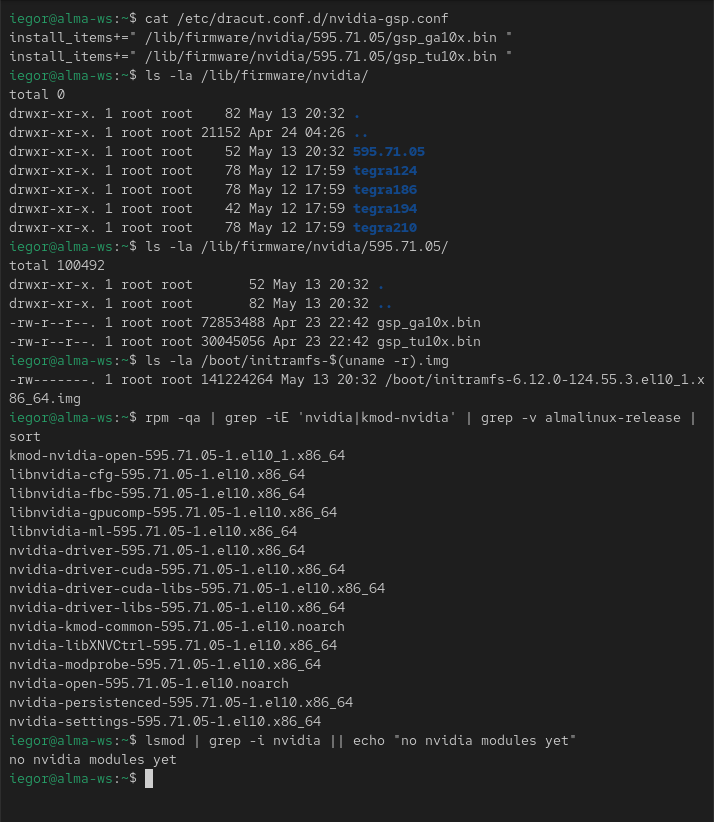
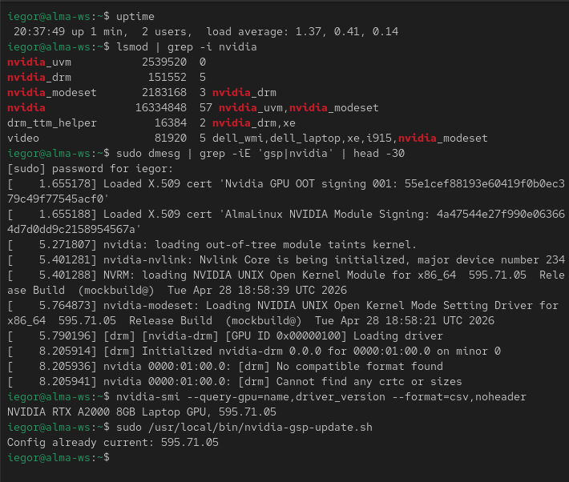
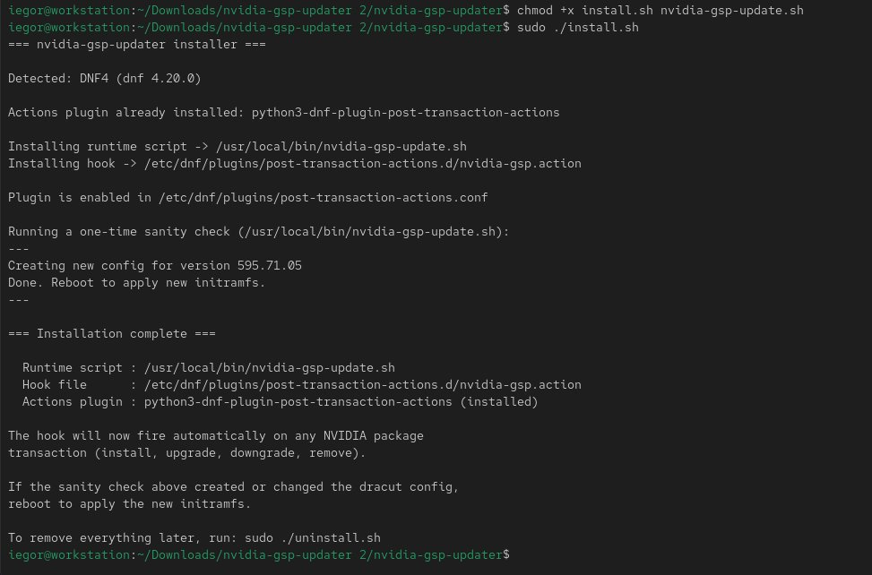
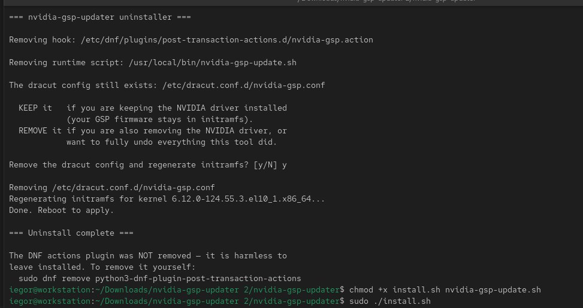

# nvidia-gsp-updater

Automatic management of NVIDIA GSP firmware paths in dracut config on AlmaLinux 10.x and other DNF-based RHEL 10 derivatives.

If you've ever had to manually edit `/etc/dracut.conf.d/nvidia-gsp.conf` and re-run `dracut --force` every time the NVIDIA driver updates, this script eliminates that ritual.

---

## The problem this solves

On AlmaLinux 10.x (and likely RHEL 10 / Rocky 10) with Turing-generation or newer NVIDIA GPUs, the GSP firmware must be included in initramfs. (GSP — GPU System Processor — exists from Turing onward, and the open NVIDIA kernel module requires it.) If the firmware isn't in initramfs, every boot logs errors like:

```
nvidia 0000:01:00.0: Direct firmware load for nvidia/595.71.05/gsp_ga10x.bin failed with error -2
NVRM: RmFetchGspRmImages: No firmware image found
```

The manual fix (originally documented on the AlmaLinux community forum) is straightforward:

1. Create `/etc/dracut.conf.d/nvidia-gsp.conf` referencing the firmware file
2. Run `sudo dracut --force --kver $(uname -r)`
3. Reboot

But the firmware version directory changes with every driver update: `595.71.05` becomes `595.85.12` becomes whatever comes next. The dracut config still points at the old path. The driver breaks on the next reboot. You repeat the manual ritual. Every. Single. Update.

This script automates that ritual so you never have to think about it again.

---

## What this does

A small, idempotent Bash script triggered automatically by DNF hooks on any NVIDIA package transaction. It:

- **On install** — creates the dracut config pointing at the newest firmware version
- **On upgrade** — updates the dracut config to the new firmware version
- **On uninstall** — removes the orphan dracut config (which would otherwise break future initramfs regenerations)
- **On no-op** — does nothing if the config is already current

After making changes, it regenerates the initramfs automatically. You only need to reboot.

---

## Status

| Item | Status |
|------|--------|
| Script logic | ✅ Tested across all reachable states |
| AlmaLinux 10.1 + DNF4 hook | ✅ Tested on bare metal |
| install.sh / uninstall.sh (DNF4) | ✅ Tested on bare metal — full uninstall/reinstall round trip |
| RHEL 10 / Rocky 10 | ⚠️ Should work — same DNF4 plugin, same dracut, but not yet empirically verified |
| DNF5 hook + DNF5 install path | ⚠️ Syntax verified against official `dnf5.readthedocs.io` docs, not yet empirically tested |
| Ampere GPUs (RTX 30xx, A-series) | ✅ Tested on RTX A2000 (GA107) |
| Ada / Hopper / Blackwell | ⚠️ Should work via Option A multi-family glob, not yet verified |

If you test it on a configuration not yet ticked, please open an issue or PR to confirm.

---

## Requirements

- **OS**: AlmaLinux 10.x (most likely also RHEL 10, Rocky 10, and other EL10 derivatives)
- **GPU**: NVIDIA card that uses GSP firmware — Turing generation or newer (Turing, Ampere, Ada, Hopper, Blackwell)
- **DNF actions plugin**:
  - DNF4: `python3-dnf-plugin-post-transaction-actions`
  - DNF5: `libdnf5-plugin-actions`
- **Privileges**: root (for installation and execution)

The script itself depends only on standard Bash + coreutils + dracut, all of which are present on any working AlmaLinux 10.x system.

---

## Installation

### Recommended: automated install

The included `install.sh` does everything for you. From inside the unpacked project directory, first make the scripts executable (archive downloads often lose the executable bit), then run the installer:

```bash
chmod +x install.sh uninstall.sh nvidia-gsp-update.sh
sudo ./install.sh
```

It will:

1. Detect whether your system uses DNF4 or DNF5
2. Check whether the matching actions plugin is installed — if not, it shows you exactly which package it wants to install and **asks for your confirmation** before running `dnf install` (no silent package installs)
3. Copy the runtime script to `/usr/local/bin/`
4. Copy the correct hook file to the correct directory for your DNF version
5. Verify the plugin is enabled
6. Run the script once as a sanity check and show you the output
7. Print a summary of what it did

After it finishes, if the sanity check created or changed the dracut config, reboot to apply the new initramfs. That's it.

To undo everything later, run `sudo ./uninstall.sh` from the same directory.

### Installing the NVIDIA driver itself

This tool manages GSP firmware config — it does **not** install the NVIDIA driver.

The order that works best: run `install.sh` first, then install the NVIDIA driver. If you already have the driver installed, that's fine too — the hook will simply handle all future updates from that point on.

If you haven't installed the driver yet, follow the official AlmaLinux guide:

<https://wiki.almalinux.org/documentation/nvidia.html>

That guide describes two install paths — a minimal package set and a fuller meta-package. This tool works identically with either one; pick whichever the guide and your needs point you to.

### Alternative: manual install

If you prefer to do it by hand, or want to understand each step, here is what `install.sh` automates.

**Step 1 — Install the DNF actions plugin.** Find out which DNF version your system uses:

```bash
dnf --version
```

If the version starts with `4.x`, install the DNF4 actions plugin:

```bash
sudo dnf install python3-dnf-plugin-post-transaction-actions
```

If it starts with `5.x`, install the DNF5 actions plugin:

```bash
sudo dnf install libdnf5-plugin-actions
```

Both can be installed if you have both DNF versions side by side. Each plugin only reads its own config directory; they don't conflict.

**Step 2 — Install the script.** Copy it to a system path and make it executable:

```bash
sudo cp nvidia-gsp-update.sh /usr/local/bin/
sudo chmod 755 /usr/local/bin/nvidia-gsp-update.sh
sudo chown root:root /usr/local/bin/nvidia-gsp-update.sh
```

**Step 3 — Install the hook.**

For DNF4:

```bash
sudo cp hooks/dnf4/nvidia-gsp.action \
  /etc/dnf/plugins/post-transaction-actions.d/
```

For DNF5:

```bash
sudo cp hooks/dnf5/nvidia-gsp.actions \
  /etc/dnf/libdnf5-plugins/actions.d/
```

**Step 4 — Verify the plugin is enabled (DNF4).**

```bash
cat /etc/dnf/plugins/post-transaction-actions.conf
```

You should see `enabled=1`. If you see `enabled=0`, edit the file and change it.

**Step 5 — Sanity check.** Run the script manually once:

```bash
sudo /usr/local/bin/nvidia-gsp-update.sh
```

If you already have a healthy NVIDIA install with a correct dracut config, you should see `Config already current: <your-driver-version>`. If you don't yet have a dracut config, the script will create one based on what's currently on disk.

---

## How it works

The script handles five states automatically:

| State | NVIDIA installed? | Config present? | Action |
|-------|------------------|----------------|--------|
| 1 | Yes | No | Create config, regenerate initramfs |
| 2 | Yes | Wrong version | Update config, regenerate initramfs |
| 3 | Yes | Current version | Do nothing (idempotent) |
| 4 | No | Yes (orphan) | Remove config, regenerate initramfs |
| 5 | No | No | Do nothing |

State detection is based on what's actually on disk:

- Presence/absence of version-numbered subdirectories in `/lib/firmware/nvidia/`
- Presence/absence and content of `/etc/dracut.conf.d/nvidia-gsp.conf`

No RPM database queries, no package-name guessing.

For supported GPUs spanning multiple architectures, the script automatically includes ALL `gsp_*.bin` firmware files shipped by the driver, not just one. This is called Option A in the codebase. The cost is a slightly larger initramfs (an extra ~16 MB in our test); the benefit is future-proofing across NVIDIA generations without code changes.

---

## Real-world test — visual walkthrough

This script was tested end-to-end on AlmaLinux 10.1 bare metal with NVIDIA driver 595.71.05 and an RTX A2000 8GB Laptop GPU. The full test:

1. Baseline working system
2. `sudo dnf remove nvidia-open` (cascades into removing 95 packages)
3. Verify hook fired correctly during the transaction
4. Reboot
5. Verify clean boot with no NVIDIA modules and no firmware errors
6. `sudo dnf install nvidia-open`
7. Verify hook fired correctly during the transaction
8. Reboot
9. Verify NVIDIA fully functional again

Test logs are preserved in `docs/test-logs/` for reference.

### Baseline state — before any testing

The system has NVIDIA installed and working, with a manually-created dracut config (one firmware file: `gsp_ga10x.bin`).



### The hook fires during uninstall (State 4)

When `dnf remove nvidia-open` finishes, the post-transaction-actions plugin invokes our script. It sees no firmware directory, finds the orphan config, removes it, and regenerates the initramfs.



### Verification after uninstall, before reboot

The config file is gone. The `595.71.05/` firmware directory is gone (only the unrelated `tegra*` dirs remain — those come from `linux-firmware`, not NVIDIA's driver). The initramfs has been regenerated and is smaller (62 MB) because it no longer carries the 72 MB GSP firmware blob.



### First boot after uninstall (State 5)

The system boots cleanly on the Intel iGPU. No NVIDIA modules loaded. No GSP firmware errors in dmesg. Running the script manually returns the State 5 message — "nothing to do".



### The hook fires during reinstall (State 1)

When `dnf install nvidia-open` finishes, the script runs again. This time it sees the freshly-installed firmware files but no existing config, so it creates a new config from scratch with BOTH firmware files the driver ships (Ampere + Turing).



### Verification after reinstall, before reboot

The config now contains TWO `install_items+=` lines — Option A doing its work. The initramfs has been regenerated and is larger (141 MB) because it now carries both firmware blobs. All NVIDIA packages installed, modules not yet loaded (waiting for reboot).



### Final boot — NVIDIA fully restored

All NVIDIA modules loaded cleanly. `nvidia-smi` reports the GPU and driver version. NO GSP firmware load errors in dmesg. Running the script manually now returns State 3 — "Config already current". The idempotency check confirms the script doesn't churn on subsequent runs.



### The automated installer

`install.sh` detects the DNF version, confirms the actions plugin, deploys the runtime script and hook, verifies the plugin is enabled, and runs a one-time sanity check. Here it is run on a system that had just had the driver reinstalled — the sanity check creates the config from scratch (State 1).



### The automated uninstaller

`uninstall.sh` removes the hook and runtime script, then asks whether to also remove the dracut config (keep it if you're keeping the driver; remove it if you're removing the driver too). It leaves the DNF actions plugin in place and prints the command to remove that yourself if desired.



---

## Caveats

### "dracut-install: ERROR" messages during uninstall

When you run `sudo dnf remove nvidia-open`, you will see scary-looking errors like:

```
dracut-install: ERROR: installing '/lib/firmware/nvidia/595.71.05/gsp_ga10x.bin'
dracut[E]: FAILED: /usr/lib/dracut/dracut-install -D ... -a -f /lib/firmware/nvidia/595.71.05/gsp_ga10x.bin
```

**This is normal.** The `kmod-nvidia-open` package has its own removal scriptlet that runs dracut. At that point, the firmware files are being removed in the same transaction, but the old dracut config still references them. dracut prints these errors but the transaction continues.

After the package removals complete, OUR post-transaction hook fires, removes the orphan config, and regenerates the initramfs cleanly. End state is correct.

### The script owns `/etc/dracut.conf.d/nvidia-gsp.conf`

The script rewrites this specific file from scratch on every relevant transaction. If you need custom dracut entries, **use a different filename** like `nvidia-custom.conf`. Dracut reads every `.conf` file in `/etc/dracut.conf.d/`, so other files are not disturbed.

### Idempotency provides recovery, not redundancy

If the script's dracut step fails (disk full, dracut crash, etc.), the file may be written but the initramfs not regenerated. This is a small consistency gap. Re-running the script after fixing the underlying issue does NOT retry the dracut step (it sees "config already current" and exits). To recover manually:

```bash
sudo dracut --force --kver $(uname -r)
```

A more robust atomic-write pattern is planned for v2 (see Future Work).

### Multiple hook fires per DNF4 transaction

DNF4 does not deduplicate hook fires. If `dnf install nvidia-open` matches both the `nvidia-*` and `kmod-nvidia-*` globs, the hook fires twice per matching package. The script's idempotency handles this cleanly: the first fire does the work; subsequent fires see "config already current" and exit. Cosmetically noisy in the output, functionally harmless.

DNF5 does deduplicate identical commands — single fire per transaction.

---

## Uninstalling

### Recommended: automated uninstall

From inside the unpacked project directory:

```bash
sudo ./uninstall.sh
```

It removes the hook file and the runtime script, and asks whether you also want to remove the dracut config (keep it if you're keeping the NVIDIA driver; remove it if you're also removing the driver). It does **not** remove the DNF actions plugin package — that's harmless to leave installed — but it tells you the command to remove it yourself if you want to.

### Alternative: manual uninstall

```bash
# Remove the hook
sudo rm /etc/dnf/plugins/post-transaction-actions.d/nvidia-gsp.action   # DNF4
sudo rm /etc/dnf/libdnf5-plugins/actions.d/nvidia-gsp.actions           # DNF5

# Remove the script
sudo rm /usr/local/bin/nvidia-gsp-update.sh

# Optionally, also remove the dracut config the script created
sudo rm /etc/dracut.conf.d/nvidia-gsp.conf
sudo dracut --force --kver "$(uname -r)"
```

You can leave the `python3-dnf-plugin-post-transaction-actions` or `libdnf5-plugin-actions` package installed; it's harmless and useful for other automations.

---

## Future work / Roadmap

The following items are deliberately out of scope for v1 but are tracked for future versions:

- **DNF5 empirical testing** — the DNF5 hook syntax is verified against official documentation but has not been run on a DNF5-default system. Fedora 41+ users are well-positioned to test this; PRs with confirmation are welcome.
- **Logging** — the current version prints to stdout (visible during DNF transactions). A future version may also log to `/var/log/nvidia-gsp-update.log` for audit purposes.
- **Atomic write** — write the new config to a temp file, run dracut, only commit on success. Eliminates the consistency gap noted in the caveats.
- **Multi-kernel handling** — currently the script regenerates initramfs only for the running kernel. A future version may iterate all installed kernels.
- **Pre-transaction cleanup** — moving the cleanup branch to a pre-transaction hook would prevent the noisy dracut errors during uninstall.

---

## Contributing

Pull requests are welcome. Areas of particular interest:

- Confirmation of correct behavior on RHEL 10 and Rocky 10
- DNF5 path empirical testing
- Roadmap items above
- Documentation improvements
- Bug reports with reproducer steps

---

## Acknowledgments

The original manual fix that this script automates was documented by community user **cimotox587** in the AlmaLinux community forum thread on the NVIDIA GSP firmware issue. This automation is built directly on top of that solution.

The AlmaLinux NVIDIA driver packaging documentation: <https://wiki.almalinux.org/documentation/nvidia.html>

DNF5 actions plugin documentation: <https://dnf5.readthedocs.io/en/latest/libdnf5_plugins/actions.8.html>

---

## License

MIT License. See [LICENSE](LICENSE) for full text.
